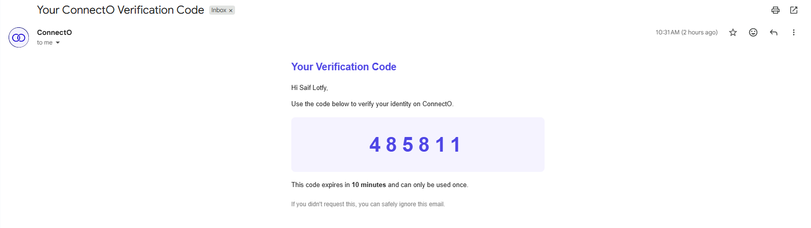

<div align="center">

# 💬 ConnectO — Social Media & Chatting API

### Production-grade ASP.NET Core 10 Web API — Clean Architecture, CQRS + MediatR, SignalR Real-Time, JWT Auth, Redis, Cloudinary, Docker

[](https://dotnet.microsoft.com/)
[](https://learn.microsoft.com/en-us/dotnet/csharp/)
[](https://www.microsoft.com/en-us/sql-server)
[](https://redis.io/)
[](https://learn.microsoft.com/en-us/aspnet/core/signalr/introduction)
[](https://cloudinary.com/)
[](https://hub.docker.com/)

</div>

---

## 📑 Table of Contents

1. [Overview](#-overview)
2. [Architecture](#-architecture--clean-architecture--cqrs)
3. [Design Patterns](#-design-patterns-used)
4. [Tech Stack](#-tech-stack)
5. [Features](#-features)
6. [Project Structure](#-project-structure)
7. [Authentication & Authorization](#-authentication--authorization)
8. [Email Service](#-email-service)
9. [Real-Time (SignalR)](#-real-time-signalr)
10. [Caching Strategy](#-caching-strategy)
11. [Media Uploads](#-media-uploads-cloudinary)
12. [Running Locally](#-running-locally)
13. [Docker Deployment](#-docker-deployment)
14. [API Reference](#-api-reference)
15. [Roadmap](#-roadmap)
16. [What I Learned](#-what-i-learned)

---

## 📖 Overview

ConnectO is a full-featured social media & real-time chatting backend — built from scratch with production concerns in mind, not a tutorial clone. Every architectural decision was deliberate: from the CQRS command/query split, to user-scoped Redis caching, to OTP email verification, to SignalR presence tracking.

- **7 independent projects** organized by Clean Architecture rings (Domain → Service → Persistence → Presentation → Web)
- **CQRS + MediatR** — every operation is an isolated Command or Query with its own handler and FluentValidation validator
- **JWT + refresh tokens** with rotation & revocation
- **OTP email verification** — Redis-backed with 10-minute auto-expiry
- **SignalR** for real-time messaging and online presence
- **Cloudinary** for profile picture uploads with automatic old-image cleanup
- **User-scoped Redis caching** on search endpoints (30s TTL, per-user isolation)
- **Containerized** with a multi-stage Dockerfile + `docker-compose.yml`

---

## 🏗️ Architecture — Clean Architecture / CQRS

```
┌──────────────────────────────────────────────────────────┐
│            Social-Media-Chatting-APP-Web (Host)          │ ← Program.cs, middleware, DI wiring
│  CORS · JWT · Swagger · Global exception handler · SignalR│
├──────────────────────────────────────────────────────────┤
│         Social-Media-Chatting-APP-Presentation           │ ← HTTP boundary, SignalR Hubs
│  Auth · UserProfile · Search · (Chat coming soon)        │
├──────────────────────────────────────────────────────────┤
│            Social-Media-Chatting-APP-Service             │ ← Application layer (CQRS handlers)
│  Commands · Queries · Validators · MappingProfiles        │
├──────────────────────────────────────────────────────────┤
│        Social-Media-Chatting-APP-ServiceAbstraction      │ ← Service interfaces (DI contracts)
│  IAuthService · IUploadService · IOtpService · …         │
├──────────────────────────────────────────────────────────┤
│          Social-Media-Chatting-APP-Persistence           │ ← EF Core, Migrations
│  AppDbContext · IdentityDbContext · Repository seed      │
├──────────────────────────────────────────────────────────┤
│            Social-Media-Chatting-APP-Domain              │ ← Pure C#, no dependencies
│  Entities · Enums                                        │
├──────────────────────────────────────────────────────────┤
│          Social-Media-Chatting-APP-SharedLibrary         │ ← Cross-cutting
│  DTOs · Result<T> · SharedResponse                       │
└──────────────────────────────────────────────────────────┘
```

**Dependency rule:** every arrow points inward. `Domain` knows nothing about EF Core, ASP.NET, Redis, or Cloudinary. Swap any infrastructure piece — only the outer layer changes.

---

## 🎨 Design Patterns Used

| Pattern | Where | Why |
|---|---|---|
| **CQRS** | `Service/Features/*/Commands` & `Queries` | Read and write paths are completely separate — queries never mutate state |
| **MediatR** | All commands/queries dispatched via `ISender` | Decouples controllers from handlers; pipeline behaviors plug in transparently |
| **Pipeline Behavior** | `ValidationBehavior<TRequest, TResponse>` | FluentValidation runs automatically for every command/query — zero boilerplate in handlers |
| **Result Pattern** | `SharedLibrary.SharedResponse.Result<T>` | Explicit success/failure instead of exceptions for control flow |
| **Repository** | `Persistence/Repositories` | Abstracts EF Core away from the service layer |
| **DTO / AutoMapper** | `Service/Common/MappingProfiles` | Never leak domain entities to the API surface |
| **Options Pattern** | `JwtOptions`, `CloudinarySettings` | Strongly-typed configuration binding |
| **Action Filter** | `[RedisCache]` attribute | User-scoped response caching without polluting controller logic |
| **Dependency Injection** | Extension methods in `Web/Extensions` | Clean DI composition — `Program.cs` stays readable across 7 projects |

---

## 🧰 Tech Stack

<div align="center">

| Layer | Technology |
|---|---|
| **Runtime** | ASP.NET Core 10 · C# 13 |
| **Data** | Entity Framework Core 10 · SQL Server 2022 |
| **Identity** | ASP.NET Core Identity |
| **Cache** | Redis 7 (StackExchange.Redis) |
| **Real-Time** | SignalR |
| **Media** | Cloudinary SDK |
| **Email** | SMTP (background queue) |
| **Messaging** | MediatR (CQRS) |
| **Validation** | FluentValidation |
| **Mapping** | AutoMapper |
| **Docs** | Swashbuckle (Swagger) |
| **Container** | Docker (multi-stage) + Docker Compose |

</div>

---

## ✨ Features

### 🔐 Identity & Auth
- Register with username, display name, email, password, optional phone number
- Email OTP verification — Redis-backed, 10-minute auto-expiry, zero manual cleanup
- Login with JWT access token + refresh token (rotation on every refresh)
- Revoke endpoint — logs user out on all devices instantly
- `[Authorize]` gates on all user-only endpoints

### 👤 User Profile
- View own private profile (full details)
- Update profile — display name, bio, website, location, phone, privacy settings
- Upload / replace profile picture via Cloudinary (old image auto-deleted)
- View public profile of any user by ID
- Privacy controls — `ShowOnlineStatus`, `ShowLastSeen`, `AllowMessageFromStrangers`

### 🔍 Search
- Search users by username or display name
- Current user automatically excluded from results
- **User-scoped Redis caching** — `user-search:{userId}:{query}` key, 30s TTL
- Results capped at 20 per query

### 🟢 Online Presence (SignalR)
- Real-time online/offline status updates via `PresenceHub`
- `LastSeen` timestamp updated on disconnect
- Respects `ShowOnlineStatus` privacy setting

### 💬 Real-Time Messaging *(in progress)*
- `ChatHub` foundation in place
- Direct messaging between users
- Message history persistence

### 🛡️ Validation Pipeline
- Every command and query has a dedicated FluentValidation validator
- `ValidationBehavior` in MediatR pipeline — invalid requests never reach handlers
- Consistent `400 Bad Request` shape across all endpoints

---

## 📂 Project Structure

```
Social-Media-Chatting-APP/
├── Social-Media-Chatting-APP-Domain/           # Pure entities + enums
│   └── Entities/
│       ├── AppUser.cs                          # Identity user + profile fields
│       └── Message.cs                          # (coming soon)
│
├── Social-Media-Chatting-APP-Persistence/      # EF Core + Identity + Migrations
│   ├── Data/
│   │   ├── AppDbContext.cs
│   │   └── Migrations/
│   └── Repositories/
│
├── Social-Media-Chatting-APP-Service/          # Application layer (CQRS)
│   ├── Features/
│   │   ├── Authentication/
│   │   │   ├── Commands/Register · Login · RefreshToken · Logout
│   │   │   ├── Queries/GetCurrentUser
│   │   │   ├── Validators/
│   │   │   └── OtpService.cs
│   │   ├── UserProfile/
│   │   │   ├── Commands/UpdateProfile · UploadProfilePicture
│   │   │   ├── Queries/GetMyProfile · GetPublicProfile
│   │   │   └── Validators/
│   │   └── SearchUsers/
│   │       ├── Queries/SearchUsersQuery + Handler
│   │       └── Validators/
│   ├── Common/
│   │   ├── Behaviors/ValidationBehavior.cs
│   │   └── MappingProfiles/userProfile.cs
│   └── Infrastructure/
│       └── UploadService.cs                    # Cloudinary wrapper
│
├── Social-Media-Chatting-APP-ServiceAbstraction/
│   └── IUploadService · IOtpService · …
│
├── Social-Media-Chatting-APP-Presentation/     # Thin controllers + SignalR Hubs
│   ├── Controllers/
│   │   ├── AuthController.cs
│   │   ├── UserProfileController.cs
│   │   └── SearchController.cs
│   ├── Hubs/
│   │   ├── PresenceHub.cs
│   │   └── ChatHub.cs
│   └── Filters/
│       └── RedisCacheAttribute.cs
│
├── Social-Media-Chatting-APP-SharedLibrary/    # Cross-cutting
│   ├── Dto's/
│   │   ├── AuthDTO's/
│   │   └── UserDTO's/
│   └── SharedResponse/Result.cs · Error.cs
│
├── Social-Media-Chatting-APP-Web/              # Host project
│   ├── Program.cs
│   ├── Extensions/
│   └── appsettings.json
│
├── Dockerfile                                  # Multi-stage (SDK → runtime)
├── docker-compose.yml                          # API + SQL Server + Redis
└── .env.example                                # Environment variable template
```

---

## 🔒 Authentication & Authorization

**Access + refresh token flow**

```
┌──────────┐                         ┌─────────────┐
│  Client  │  POST /auth/login        │    API      │
│          │ ───────────────────▶    │             │
│          │   access token (15m)    │             │
│          │   refresh token (7d)    │             │
│          │ ◀───────────────────    │             │
│          │                         │             │
│          │  requests with Bearer   │             │
│          │ ───────────────────▶    │             │
│          │                         │             │
│          │  when access expires:   │             │
│          │  POST /auth/refresh     │             │
│          │ ───────────────────▶    │             │
│          │   NEW access + NEW refresh            │
│          │   (old refresh revoked) │             │
│          │ ◀───────────────────    │             │
└──────────┘                         └─────────────┘
```

**OTP Email Verification flow**

```
Register → OTP generated → stored in Redis (TTL: 10min) → sent via SMTP background queue
                                      ↓
                         POST /auth/verify-email { email, otp }
                                      ↓
                          Redis validates → user confirmed
```

- OTP auto-expires in Redis — zero cleanup cron jobs needed
- Background email queue (`BackgroundEmailQueue`) prevents SMTP from blocking the HTTP response

---

## ✉️ Email Service

### How it works
- Auth flows call `OtpService.GenerateAndSendAsync(...)` to create a 6-digit code and send it to the user.
- `OtpService` stores the OTP in Redis with a 10-minute TTL and enforces a 3-attempt limit.
- The actual email send is asynchronous: services enqueue a job into `BackgroundEmailQueue` and return immediately.
- `EmailSenderBackgroundService` runs in the background, dequeues jobs, and calls `EmailService.SendAsync(...)`.
- `EmailService` uses MailKit with STARTTLS to connect to Gmail (`smtp.gmail.com:587`), authenticate, and send HTML emails.
- Password reset uses `AuthService.ForgotPasswordAsync(...)` to generate a short-lived reset token and send the reset link by email.

### Configuration
- Configure SMTP and sender details in `Social-Media-Chatting-APP-Web/appsettings.json` under `EmailSettings`.
- Gmail requires 2FA and an App Password (use the App Password in `EmailSettings:Password`).
- For production, store secrets in a secure config provider and do not commit them to git.

### Screenshot


---

## ⚡ Real-Time (SignalR)

**Presence Hub** — tracks online/offline status in real time

```
Client connects with JWT       →  PresenceHub.OnConnectedAsync()
                                    → sets IsOnline = true
                                    → broadcasts to followers (coming soon)

Client disconnects             →  PresenceHub.OnDisconnectedAsync()
                                    → sets IsOnline = false
                                    → updates LastSeen = DateTime.UtcNow
```

**Chat Hub** — foundation ready, full messaging in progress

```
Client joins conversation      →  ChatHub
                                    → send/receive messages in real time
                                    → typing indicators (coming soon)
                                    → read receipts (coming soon)
```

---

## 🚀 Caching Strategy

**User-scoped search cache**

```
         ┌─────────────────────────────┐
         │  GET /api/search?q=saif     │
         │  Authorization: Bearer ...  │
         └──────────────┬──────────────┘
                        │
              Extract userId from JWT
                        │
         ┌──────────────▼──────────────┐
         │  Cache key:                 │
         │  user-search:{userId}:?q=saif│
         └────┬──────────────┬─────────┘
            hit              miss
             │                │
     ┌───────▼──┐   ┌─────────▼─────────┐
     │ Return   │   │  Query SQL Server  │
     │ cached   │   │  Map → DTOs        │
     │ JSON     │   │  SET Redis TTL 30s │
     └──────────┘   └────────────────────┘
```

- **TTL: 30 seconds** — fresh enough for a social app, long enough to absorb repeated searches
- **Per-user isolation** — `user-search:userA:?q=saif` ≠ `user-search:userB:?q=saif`
- **No cross-user leakage** — unauthenticated requests are blocked by `[Authorize]` before the filter runs

---

## 🖼️ Media Uploads (Cloudinary)

Profile picture upload flow:

```
POST /api/profile/picture  (multipart/form-data)
         │
         ▼
  UploadProfilePictureCommandValidator
  • file not null
  • size ≤ 5 MB
  • extension: .jpg / .jpeg / .png / .webp
  • content-type: image/jpeg / image/png / image/webp
         │
         ▼
  UploadService.UploadAsync()
  → uploads to Cloudinary folder: profile-pictures/
  → returns { PublicId, Url }
         │
         ▼
  If user had previous picture:
  → UploadService.DeleteAsync(oldPublicId)
         │
         ▼
  AppUser.ProfilePicture = newUrl
  AppUser.ProfilePicturePublicId = newPublicId
  SaveChanges()
```

---

## 🏃 Running Locally

### Prerequisites
- [.NET 10 SDK](https://dotnet.microsoft.com/download)
- Docker Desktop (for SQL Server + Redis)

### Option A — Docker Compose (easiest)

```bash
git clone https://github.com/sefffo/Social-Media-Chatting-APP.git
cd Social-Media-Chatting-APP
cp .env.example .env   # fill in your secrets
docker-compose up --build
```

→ Swagger opens at **http://localhost:5000/swagger**

This spins up **SQL Server 2022 + Redis 7 + the API** on a private Docker network.

### Option B — Native dotnet

```bash
dotnet restore
dotnet ef database update --project Social-Media-Chatting-APP-Persistence --startup-project Social-Media-Chatting-APP-Web
dotnet run --project Social-Media-Chatting-APP-Web
```

Configure `appsettings.Development.json` with your local SQL Server, Redis, SMTP, and Cloudinary credentials first.

### Required Environment Variables

```env
ConnectionStrings__DefaultConnection=Server=...;Database=ConnectO;...
ConnectionStrings__Redis=localhost:6379
JwtOptions__SecretKey=your-secret-key
JwtOptions__Issuer=ConnectO
JwtOptions__Audience=ConnectO
Cloudinary__CloudName=your-cloud-name
Cloudinary__ApiKey=your-api-key
Cloudinary__ApiSecret=your-api-secret
EmailSettings__Host=smtp.gmail.com
EmailSettings__Port=587
EmailSettings__Email=your-email
EmailSettings__Password=your-app-password
```

---

## 🐳 Docker Deployment

**Multi-stage Dockerfile — how & why**

```dockerfile
# Stage 1: SDK image (~800MB) — compiles the code
FROM mcr.microsoft.com/dotnet/sdk:10.0 AS build
WORKDIR /src

# Copy .csproj files FIRST, restore, THEN copy source.
# Changing a .cs file reuses the cached restore layer → fast rebuilds.
COPY *.slnx .
COPY */*.csproj ./
RUN dotnet restore

COPY . .
RUN dotnet publish Social-Media-Chatting-APP-Web/... -c Release -o /app/publish --no-restore

# Stage 2: Runtime image (~220MB) — only what's needed to run
FROM mcr.microsoft.com/dotnet/aspnet:10.0 AS final
WORKDIR /app
COPY --from=build /app/publish .
EXPOSE 8080
ENTRYPOINT ["dotnet", "Social-Media-Chatting-APP-Web.dll"]
```

- **Final image ≈ 220 MB** instead of ~800 MB — no SDK, no source code in production
- `docker-compose.yml` wires API + SQL Server 2022 + Redis 7 with health-checks

---

## 📖 API Reference

Full interactive docs via **Swagger UI** when running locally at `/swagger`.

### Authentication
| Method | Endpoint | Description |
|---|---|---|
| POST | `/api/auth/register` | Create account |
| POST | `/api/auth/verify-email` | Verify OTP |
| POST | `/api/auth/resend-otp` | Resend OTP |
| POST | `/api/auth/login` | Returns access + refresh tokens |
| POST | `/api/auth/refresh` | Rotate tokens |
| POST | `/api/auth/logout` | Revoke refresh token |
| GET  | `/api/auth/me` | Current user info |

### User Profile
| Method | Endpoint | Description |
|---|---|---|
| GET   | `/api/profile/me` | My full profile |
| PATCH | `/api/profile` | Update profile fields |
| POST  | `/api/profile/picture` | Upload profile picture |
| GET   | `/api/profile/{userId}` | Public profile of any user |

### Search
| Method | Endpoint | Description |
|---|---|---|
| GET | `/api/search?q={term}` | Search users (cached, user-scoped) |

---

## 🗺️ Roadmap

- [x] Authentication (Register, Login, OTP, JWT + Refresh Tokens)
- [x] User Profile (view, update, profile picture upload via Cloudinary)
- [x] User Search with user-scoped Redis caching
- [x] SignalR Presence Hub (online/offline tracking)
- [ ] Direct Messaging (ChatHub — in progress)
- [ ] Message history persistence
- [ ] Typing indicators & read receipts
- [ ] Follow / Friend system
- [ ] Posts & Feed
- [ ] Notifications
- [ ] CI/CD pipeline (GitHub Actions → Azure)

---

## 🎓 What I Learned

| Area | Takeaway |
|---|---|
| **CQRS + MediatR** | Splitting reads and writes makes every feature self-contained — adding a new feature doesn't touch existing handlers |
| **Pipeline Behaviors** | Validation as a cross-cutting concern — handlers stay clean, validators stay focused |
| **Result Pattern** | Business failures (404, 403, validation) are values, not exceptions — the caller always knows what to expect |
| **Redis OTP** | TTL-based expiry removes the need for cleanup jobs entirely — let the infrastructure handle it |
| **User-scoped caching** | Public caches leak data between users — the key must always include the requesting user's identity |
| **SignalR + JWT** | SignalR doesn't use Authorization headers — the token must be passed via query string and validated manually |
| **Cloudinary cleanup** | Uploading a new image without deleting the old one leaks storage — always store `PublicId` alongside the URL |
| **FluentValidation** | Declarative validation rules are far more readable and testable than imperative `if` chains |

---

<div align="center">

### 🔗 Related

[**E-Commerce REST API**](https://github.com/sefffo/E-Commerce-dotnet-API) · [**E-Commerce Dashboard**](https://github.com/sefffo/ecommerce-dashboard)

---

**Built by [Saif Lotfy](https://www.linkedin.com/in/saif-lotfy-769451310/)** — backend engineer, Cairo 🇪🇬

*If this project helped you, a ⭐ on the repo would mean the world.*

</div>
